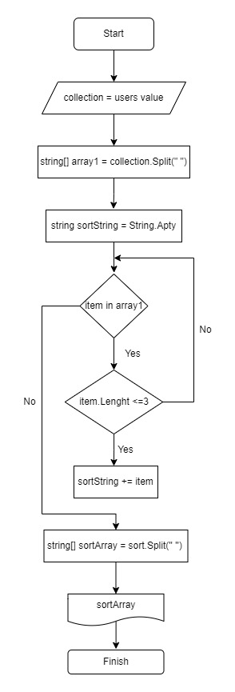

**Задача:**
Написать программу, которая из имеющегося массива строк формирует новый массив из строк, длина которых меньше, либо равна 3 символам. Первоначальный массив можно ввести с клавиатуры, либо задать на старте выполнения алгоритма. При решении не рекомендуется пользоваться коллекциями, лучше обойтись исключительно массивами.

**Примеры:**
[“Hello”, “2”, “world”, “:-)”] → [“2”, “:-)”]
[“1234”, “1567”, “-2”, “computer science”] → [“-2”]
[“Russia”, “Denmark”, “Kazan”] → []

**Блок схема**

**Решение задачи:**

1. При запуске программы пользователь вводит с клавиатуры строки, которые сохраняем в переменную collection.

 Console.WriteLine("Введите строки через запятую: ");
 string collection = Console.ReadLine()!;   

2. Из полученной строки при помощи метода Split() создаем строковый массив.

 string[] array = collection.Split(", ");

3. Создаем метод SortArray, который принимает в качестве аргумента массив строк и возвращает отсортированный массив строк. В методе:

создаем пустую строку sort1, в которую будем записывать отсортированные элементы массива;

при помощи цикла foreach пройдем по всем элементам массива и т.к. элементами являются строки, проверим их длину на соответствие условию при помощи свойства Length;

если длина строки соответствует условию - записываем значение элемента в переменную sort;

после сортировки всех элементов, полученную строку опять же при помощи метода Split() преобразуем в новый строковый массив;

возвращаем отсортированный массив.

  string[] SortArray(string[] array1)
  {
      string sortArray = String.Empty;
      foreach (var item in array1)
      {
          if (item.Length <= 3)
          {
              sortString += item + " ";
          }
      }
      string[] sortArray = sortString.TrimEnd().Split(" ");
      return sortArray;
  }
4. Затем делаем вызов метода SortArray и выводим новый массив в консоль.

 Console.WriteLine($"[{String.Join(", ", (array1))}] -> [{String.Join(", ", SortArray(array1))}]");